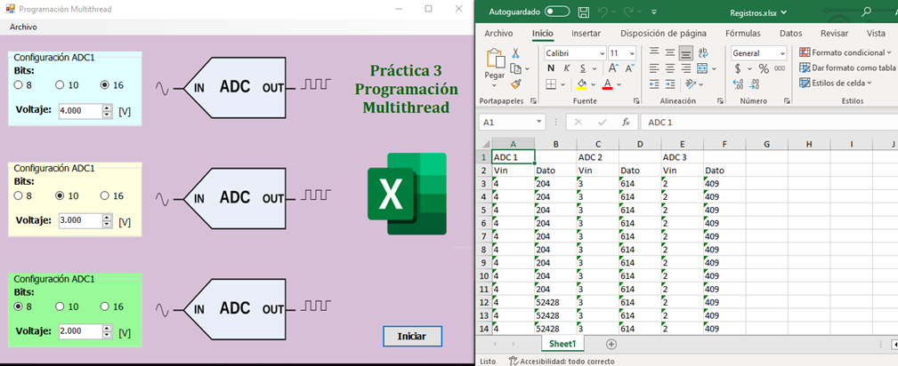

<div align="center" id="top"> 
  

  &#xa0;
</div>

<h1 align="center">Convertidor AD Multithreading WinForms</h1>

<p align="center">
  

  

  

  
</p>


<p align="center">
  <a href="#dart-description">Descripción</a> &#xa0; | &#xa0; 
  <a href="#sparkles-roadmap">Guía</a> &#xa0; | &#xa0;
  <a href="#white_check_mark-requirements">Requisitos</a> &#xa0; | &#xa0;
  <a href="#checkered_flag-starting">Inicio</a> &#xa0; | &#xa0;
  <a href="#wrench-support">Soporte</a> &#xa0; | &#xa0;
  <a href="#memo-license">Licencia</a> &#xa0; | &#xa0;
  <a href="https://github.com/AlexisCastro12" target="_blank">Autor</a>
</p>

<br>

## :dart: Descripción ##

Convertidor AD Multithreading WinForms es una aplicación programada mediante C# y el framework .NET (4.7) con Windows Forms en el entorno de desarrollo Visual Studio 2019 que aprovecha los conceptos de programación orientada a objetos y el multithreading (hilos multiplies) así como tambien herramientas externas al IDE como la paquetería office para generar y capturar de datos en tiempo real.

Este proyecto facilita el cálculo de mútliples convertidores análogico/digital (A/D). También, permite identificar los efectos de las variaciones de los parámetros que intervienen en este tipo de sistemas. Algunos de estos parámetros que se pueden modificar son el voltaje de entrada y el número de bits mediante la interfaz gráfica. Sin embargo, es posible modificar otras variables desde el código fuente del programa.

Principalmente, esta aplicación es de gran utilidad para estudiantes de ingeniería que comiencen a adentrarse en el mundo del procesamiento de digital de señales. No obstante, sirve también como una guía para programadores que requieran aprender a capturar datos generados por una aplicacion WinForms en un archivo temporal de una manera sencilla.

## :sparkles: Guía

Actualmente, las características con las que este proyecto cuenta son:

:heavy_check_mark: Una interfaz gráfica con Radiobuttons para seleccionar el numero de bits para representar un dato y con Textboxes que únicamente permiten entradas numéricas para ingresar el voltaje de entrada que se desea convertir.

:heavy_check_mark: Existe un botón que permite iniciar y finalizar el proceso de conversión. Cada proceso es un ciclo completo.

:heavy_check_mark: Es posible modificar los datos de entrada (bits y Voltaje) antes, durante y despues de cada ciclo de conversión. Sin embargo, solo se capturan los datos que estuvieron presentes despues de iniciar y antes de finalizar el proceso.

:heavy_check_mark: Los datos generados se capturan periodicamente en un archivo Excel al que se puede acceder después de completar un ciclo de conversión haciendo clic sobre la imagen del logo de Excel.

:heavy_check_mark: Cada vez que inicia un ciclo de conversión el archivo excel se sobreescribe y se pierde la información del ciclo anterior.

El objetivo inicial de este proyecto es aplicar el concepto de multithreading en programación y apender a capturar datos generados en tiempo real para un análisis posterior. Hasta ahora, se ha cumplido con esta tarea, sin embargo existen muchas areas de oportunidad para escalar esta aplicación y otorgarle una mayor funcionalidad. Algunas propuestas para futuras mejoras son:

:pushpin: Crear una interfaz que permita recibir señales analógicas reales desde un circuito externo por algún puerto de la computadora.

:pushpin: Cada usuario puede crear la cantidad de convertidores que el desee limitandolo a un número arbitrario que evite algun colapso de su equipo por el uso excesivo de memoria.

:pushpin: Cada usuario decide si la información de salida debe ir en un solo documento excel o en archivos separados.

## :white_check_mark: Requisitos

Antes de comenzar :checkered_flag:, es necesario tener instalado [Git](https://git-scm.com).

## :checkered_flag: Inicio

```bash
# Clone this project
$ git clone https://github.com/AlexisCastro12/Convertidor-AD-Multithreading-WinForms.git

```

Busca la carpeta en la ruta donde se clonó el repositorio, acceda a './bin/Debug/' y ejecute como administrador la aplicación Practica3_Threads_9CM11.exe.

Inicialmente, el voltaje esta en 0.0000 y los bits en 8 para todos los convertidores. Además, no esta activo ningún ciclo de conversión.

Modifique los parámetros como los necesite e inicie el ciclo de conversión con el boton 'Iniciar' en el momento que lo desee.

Existe un archivo excel precargado que tiene datos basura y es el que visualizará si aun no inicia algún ciclo de conversión


## :wrench: Soporte ##

Si tiene problemas con el proyecto o necesita información adiciona, por favor contactame <alexis1204.aacs@gmail.com> :e-mail:.

## :memo: Licencia ##

Este proyecto esta bajo la Licencia MIT. Para mas detalles, vea el archivo [LICENSE](LICENSE).


Hecho con :heart: por <a href="https://github.com/AlexisCastro12" target="_blank">AlexisCastro12</a>

&#xa0;

<a href="#top">regresar</a>
